#Advanced Topics in Systems Research Final Project
R03922085 陳申  
R03922102 彭國祐  
R04922161 廖唯辰  

----

## 1. Introduction  
現在 machine learning and deep learning 盛行，許多公司都推出各自的 open source machine learning or deep learning framework，像是 Google 推出 的TensorFlow，Berkeley Vision and Learning Center 推出的 Caffe 等。在眾多 framework 中，我們好奇到底何者在什麼樣的情況下比較好，或是它們的瓶頸為何。除此之外，他們是否能夠利用 distrubted 的架構，或是有效利用 GPU，我們也想知道。這份期末 project 的目標就是 profiling 各項 framework，看看架構為何以及有何瓶頸，並試著改進。

## 2. Brief introduction to deep learning

`Deep learning` 可以想像成是一個自動學習的生產線, 經由我們一開始設定好的 Hypothesis, 來達到不斷學習的目的, 利用 deep learning 可以取代過去人們人工所產生的 feature, 達到經由機器自動從 Data 中取得自己所需要的 features.  
而deep learning 由於是一種 neural network, 可以輕易的加多其內部的 node 來達報使 model 複雜化的目的, 且隨著現在的 neural network 的層數與寬度愈來愈深, 越來越大, 所需要的計算量也就越來越大, 因此對於計算有幫助的方法像是, distributed framework, 及利用 gpu 的 hetergeneous 來達到加速的幫助, 就是現在一個很重要的課題.

## 3. distributed deep learning framework
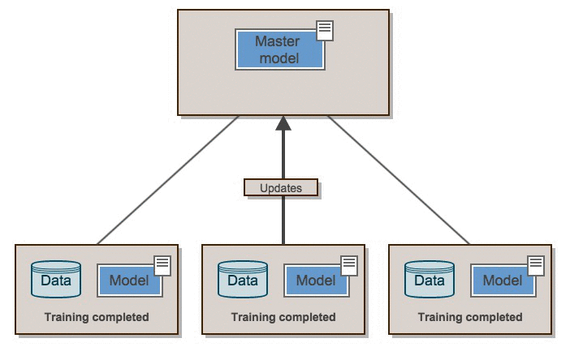  

我們試著安裝這三個distributed deep learning framework
### 3-1. deeplearning4j, elephas, mxnet
deeplearning4j: 一個開源的商業用途 deep learning library。以 Java 和 Scala 寫成，結合 Hadoop 和 Spark。  
http://deeplearning4j.org/  

Elephas: Keras 延展至 distributed at scale with Spark.  
https://github.com/maxpumperla/elephas  

Mxnet: 以彈性和效率為目的設計的 deep learning framework。  
https://github.com/dmlc/mxnet/blob/master/README.md  

### 3-2. Fail to install these three framework
由於一些版本和環境的問題，而且官網的tutorial 並不是非常詳細，所以我們並沒有安裝成功。
## 4. We changed our goal on GPU deep learning profiling
我們將我們的目標改為比較不同framework在GPU的performance和 bottleneck 。我們安裝了這三個支援deep learning framework: TensorFlow, Caffe, Torch  
### 4-1.
TensorFlow: 由Google推出，用data flow graphs建構的的機器學習和深度學習的工具。  
https://www.tensorflow.org/  
  
 data flow graph  

Caffe: 由Berkeley Vision and Learning Center推出的deep learning framework。  
http://caffe.berkeleyvision.org/

Torch: 由Facebook推出的deep learning framework。  
http://torch.ch/

### 4-2 difficulty
一些版本上的問題，像是Tensorflow需要安裝CUDA 7.0，然而之前我們安裝Caffe時裝了CUDA 7.5，降版本就遇到許多問題。網路上的tutorial的環境跟我們的電腦不一定相同，因此花了許多時間解決這類型的問題。

## 5. profiling

### 5-1 profiling tools

##### Nvidia series profiling tools  
Nvida推出的跨平台的profiling tools，可以得出CUDA API call以及GPU kernel的執行時間。有完整的圖形化介面  
 https://developer.nvidia.com/nvidia-visual-profiler

##### cProfile    
一個 python 的 profiling tools，只能得到 CPU 的各 function 的執行時間。   
https://docs.python.org/2/library/profile.html

##### PyCallGraph  
Python 的 profiling tools，能將 python 的各項 function call 畫成圖，並附上執行時間。  
https://pycallgraph.readthedocs.org/en/master/

##### google-perftools -> kcachegrind  
C++ 的 profiling tools，有完整的圖形化介面。  
https://github.com/gperftools/gperftools

### 5-2 Environment

`Intel(R) Core(TM) i7-4790, 8 cores`  
`RAM 20GB`  
`Ubuntu 14.04`    
`Nvidia GTX 950`  

### 5-3 profiling outcome
Nvidia visual profile   
#####Caffe: 4 hidden layer, batch size 100   

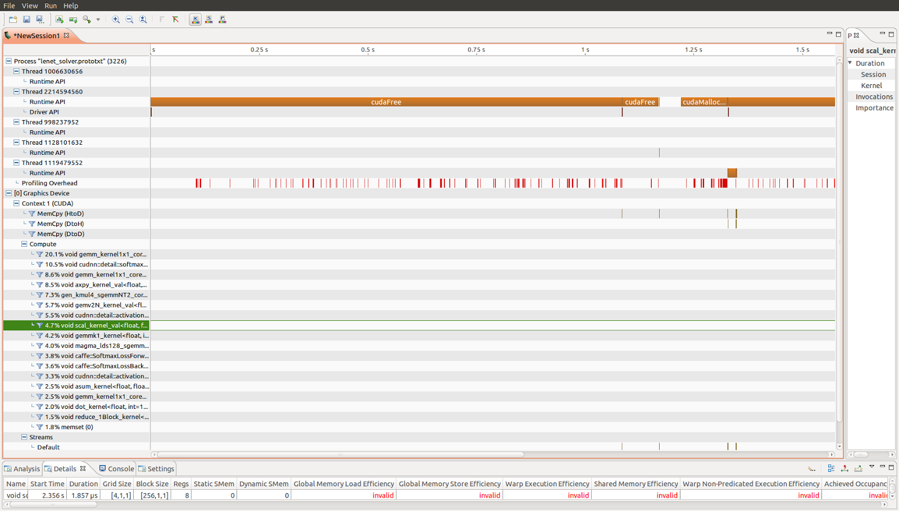

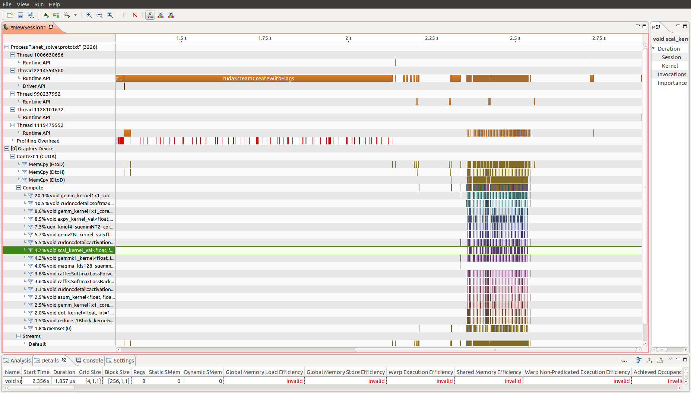  

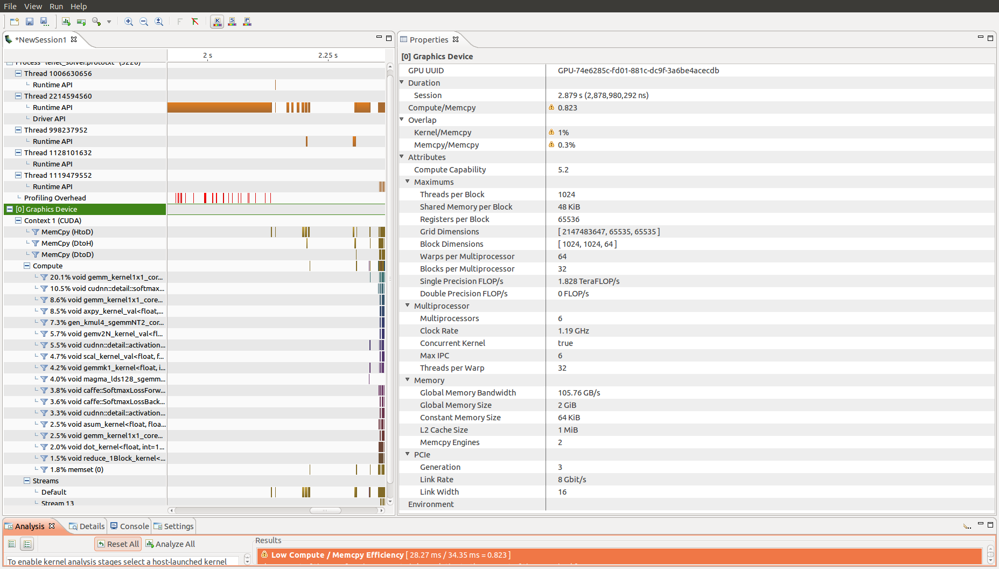

此 profiling tools 點出一些我們遇到的問題:  
```
Low Compute/Memcpy Efficiency [28.27ms/34.35ms=0.823]  
Low Memcpy/Compute Overlap [293.948us/28.27ms= 1%]  
Low Memcpy Throughtput [205.152MB/s avg,for memcpys accounting for 5.5% of all memcpy time]  
Low Memcpy Overlap [22.306us/8.643ms = 0.3%]  
Low Computation Utilization [28.27ms/2.879s = 1%]  
Kernel Optimization Priorities [gemm_kernel1x1core()]  
```

GPU compute 的時間比 memory copy 的時間很低，如同作業一 HSA emulation  
所觀察的，我們認為增加 deep learning 層數可以增加 CPU 的使用率。因此接下來 profile 10 hidden layer, batch size 100   
#####10 hidden layer, batch size 100
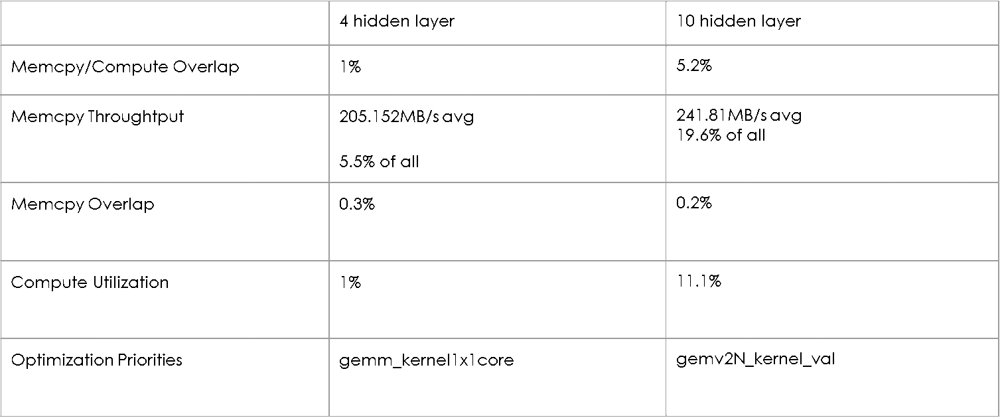

儘管 GPU compute/memory copy 仍然不高，增加層數確實提高了computation使用率。除此之外，profiling tools 提出改動效益最高，也就是最執行時間最多的 kernel 為矩陣乘法。  
接著我們試著 profile 另一種 framework  
#####tensorflow: 4 hidden layer, batch size 100
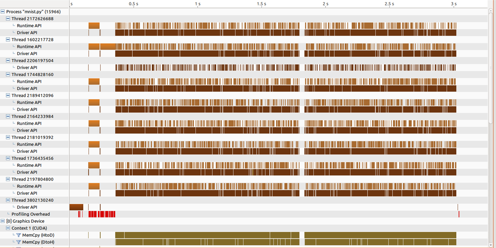  

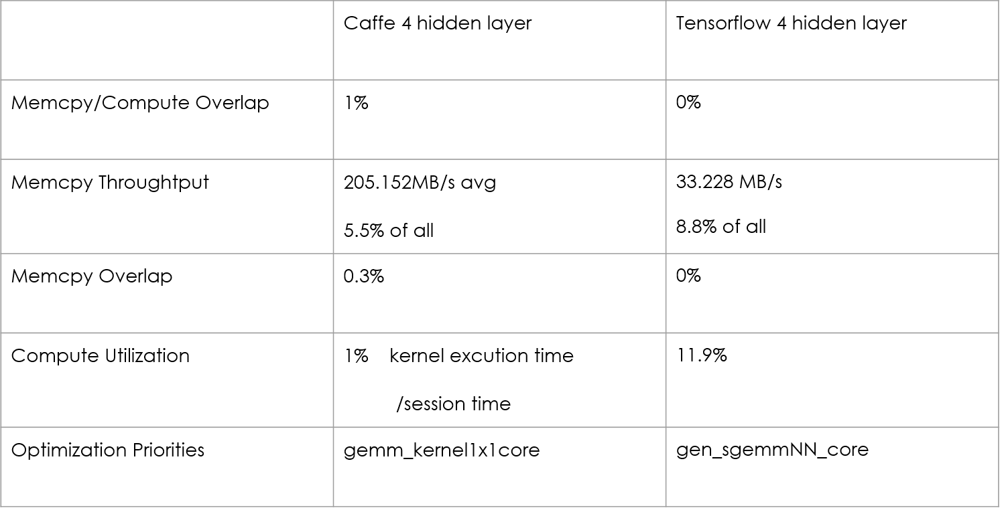  
TensorFlow 的 Compute utilization 比起 caffe 改善非常多。  
#####tensorflow 10 hidden layer  10000 Iteraions  batch size = 15000  
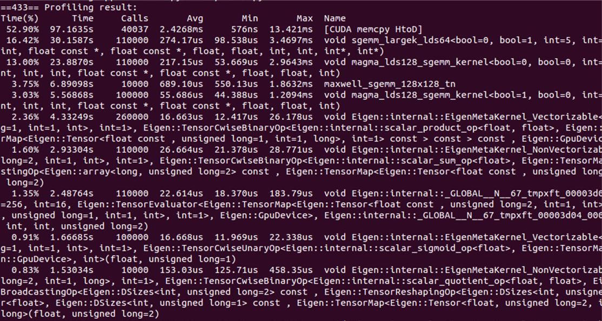  
但是最花時間的 API 仍然是 memory copy  
我們想看的不只是 GPU 的執行狀況，也想知道 CPU 的執行時間，因此又用了其他的 profiling tools  

PyCallGraph
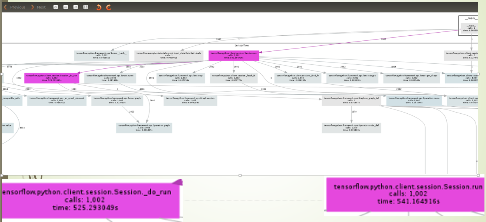  
前述的 profiling tools 只看的到 python front-end 的執行狀況，我們想知道底層 C++ 的執行情況，因此也使用了google-perftools -> kcachegrind profiling tools  

google-perftools -> kcachegrind  


##6. Try to improve tensorflow  
TensorFlow 使用非同步的 memory copy，將 data 從 sender 送到 pinned memory，再送到 GPU memory。  
我們觀察 input data 在 DNN 中並不會被改動，也許 input data 可以直接送到 GPU 的 memory，而不需要透過 pinned memory，以節省時間和空間。  
改動的檔案包含:  
rendezvous<span></span>.cc defines protocol between sender and receiver, and it also define how to transfer data.

tensor.h, tensor<span></span>.cc  declare and define data structures to describe input data and data between layers.   

google-perftools -> kcachegrind  

#####Original
8 hidden layers,  
10000 batch  
Total hits cost: 3345  
Time:41.65  


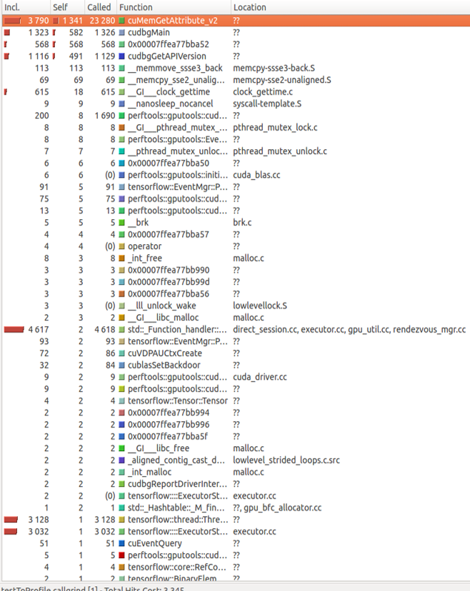   


#####After  
Batch size: 10000  
Total hits cost 2268  
Time 41.85  


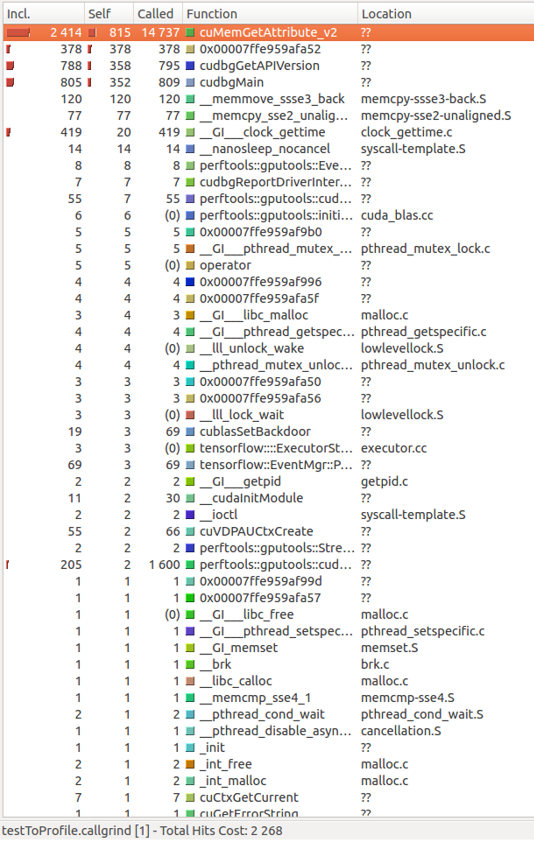  

結果並執行時間沒有改善，但是 Hit cost 減少。

## 7. discussion
在我們所研究的 framework 中，caffe 及 tensorflow 可以看出他們設計不同，像 caffe 很明顯只有針對single node所製作，因此省去了很多溝通上的 overhead，但 tensorflow 卻不同，由於他是為了 distributed 架構所設計，有明確的 master client 架構，可以很輕易地移植到多顆 GPU 或者是分散式系統上。  

因此tensorflow有溝通上的 overhead，像是 rendezvous 機制，在非 distrubuted 架構上也許是不需要的。如果要使 tensorflow 在single node下運行得更好，我們必須要大幅改動他在溝通上的機制。

## 8. future work
朝著 Distributed 架構下繼續努力
